# ~/.claude - Claude Code カスタム環境

Claude Code の開発ワークフローを拡張するスキル・エージェント・ツール群。

## ワークフロー

スキルはプロジェクトのライフサイクルに沿って連携する。典型的な流れは以下の通り。

```mermaid
graph TD
    subgraph "プロジェクト開始"
        A["/spec-gen"] -->|"設計ドキュメント + feat Issue"| B["/impl &#35;Issue"]
        B -->|"実装 → レビュー → PR"| C["/code-review-git"]
        C -->|"PR前のセルフレビュー"| C2["/doc-drift-git"]
        C2 -->|"ドキュメント整合性チェック"| D["/release"]
        D -->|"Changelog + タグ + GitHub Release"| E((完了))
    end

    subgraph "運用・保守"
        F["/bug-report"] -->|"バグを調査して Issue 作成"| G["/bug-fix &#35;Issue"]
        G -->|"修正 → テスト → PR"| H((完了))
        I["/code-review"] -->|"コードベース全体の品質チェック"| J((レポート))
        K["/doc-drift"] -->|"ドキュメントと実装の乖離検出"| L((レポート))
    end
```



> **チーム版**: `/impl-team`, `/bug-fix-team`, `/code-review-team`, `/doc-drift-team` で Agent Teams による並列処理が可能。
> **Git 差分版**: `/code-review-git`, `/doc-drift-git` で変更差分のみを対象にチェック可能。

### 典型的なシナリオ

| シナリオ | 手順 |
|---------|------|
| **新機能を作る** | `/spec-gen` → 設計 → `/impl #Issue` → 実装 → `/code-review-git` → セルフレビュー → `/doc-drift-git` → ドキュメント整合性チェック → PR |
| **バグを直す** | `/bug-report` → Issue 作成 → `/bug-fix #Issue` → 修正 → PR |
| **リリースする** | `/release` → Changelog + タグ + GitHub Release |
| **品質を確認する** | `/code-review` で全体チェック、`/doc-drift` でドキュメント乖離チェック |

## スキル (`skills/`)

スラッシュコマンド（`/skill-name`）で呼び出せるワークフロー定義。
各スキルにはチーム版があり、Agent Teams で並列処理できる。

| スキル | 概要 |
|--------|------|
| `/spec-gen` | 設計ドキュメント一式を対話的に作成 |
| `/impl` | 要件→実装→レビュー→改善を小スコープで反復 |
| `/impl-team` | 複数開発者が Contract-First で並列実装 |
| `/bug-report` | 対話形式でバグをヒアリングし Issue 作成（非エンジニア対応） |
| `/bug-fix` | 再現確認→原因特定→修正→回帰テストを体系的に実行 |
| `/bug-fix-team` | 複数の調査者が異なる仮説を並列検証 |
| `/code-review` | コードベース全体の品質・リファクタリングレビュー |
| `/code-review-git` | Git 差分を対象にコード品質チェック＋ドキュメント乖離検出 |
| `/code-review-team` | アーキテクチャ・セキュリティ・性能の専門レビュアーが並列検査 |
| `/doc-drift` | ドキュメントと実装の乖離を検出しレポート生成 |
| `/doc-drift-git` | Git 差分を対象にドキュメントとコードの整合性チェック |
| `/doc-drift-team` | 複数チェッカーがドキュメントグループごとに並列検証 |
| `/release` | Changelog 生成・バージョンタグ・GitHub リリースノート作成（日英併記） |

## エージェント (`agents/`)

Task ツールの `subagent_type` で指定して使うカスタムエージェント。

| エージェント | 概要 |
|-------------|------|
| `develop` | 最小限のコード変更を実装する開発者エージェント |
| `review` | 読み取り専用でコード変更をレビューするエージェント |

## ツール (`tools/`)

### swm - LLMプロバイダー切り替えCLI

複数の LLM プロバイダー（Claude, GLM, DeepSeek, ローカル等）の環境変数をワンコマンドで切り替える Go ツール。

```bash
# セットアップ
cd ~/.claude/tools/swm && make install
swm init

# ~/.bashrc or ~/.zshrc に追加
eval "$(swm env)"
```

| コマンド | 動作 |
|---------|------|
| `swm init` | `~/.claude/llm/providers.yaml` を生成 |
| `swm use <name>` | アクティブプロバイダーを切り替え |
| `swm current` | 現在のプロバイダーとモデルを表示 |
| `swm list` | 全プロバイダー一覧（アクティブに★） |
| `swm env` | 環境変数を `export` 形式で出力 |

## ディレクトリ構成

```
~/.claude/
├── CLAUDE.md              # グローバル指示（コミット規約・コーディング方針）
├── settings.json          # Claude Code 設定（Agent Teams 有効化等）
├── skills/                # スラッシュコマンドで呼べるスキル定義
├── agents/                # カスタムエージェント定義
├── tools/swm/             # swm CLI ソースコード
└── llm/
    ├── providers.yaml     # LLM プロバイダー定義
    └── active             # 現在のアクティブプロバイダー
```
